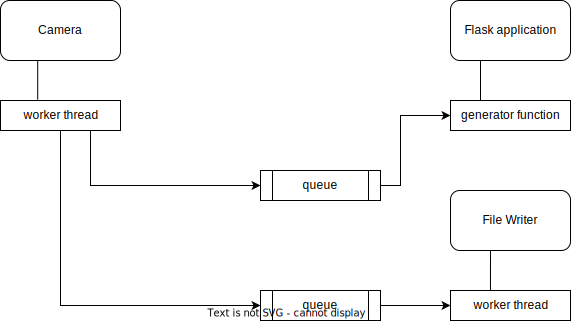

# videorecorder

## description
The idea of this project is to make a simple videorecorder for car using RaspberryPi Zero.
The basic functionality assumes:
 - capture video in realtime by RPI camera module
 - write videofootage by chunks with given duration
 - allow control by user via web-interface (stream the video into browser, optionally)

The choice of Raspberry Pi Zero is not determined by any analysis of single-board computers.
I bought it a 5 years ago, had played enough and since that time the RPI Zero is gathering a dust on my table.

Instead of attach and setup a touch-screen I've choosen web-interface as a solution to control my videorecorder
because something bad happened with HDMI port and any display when I plug it to my RPI shows only a blank screen
(sometimes the message 'no signal').

## architecture
The initial design is depictured below.

The Camera class is responsible for acquiring videostream from RPI camera module. It starts a worker thread to capture frames and put these frames into queues. The one of the queues 
is a frames' source for Flask application, the second one is a source for the instance of FileWriter class. The Flask application is responsible for serving user requests to stream 
video and setup videorecorder. The video is streamed with MJPEG protocol, Flask framework provides support of that with concept of 'generator' function 
([see here](https://blog.miguelgrinberg.com/post/video-streaming-with-flask)) . The class FileWriter provides functionality to merge received frames into media-container (AVI only).
The instance of FileWriter starts worker thread which pull frames from queue and process them - the frame taken from queue is resized if needed and appended to media-container.

## updated [date]
During the experimental operation it was found that Flask application (http server) becomes irresponsive when using camera resolution 1024 x 768. 
I decided to simplify design by eliminating the streaming of the video into browser. Also it was revealed that camera is able to give only 2 frames per second.
I'm going to explore the picamera API documentation ([see here](https://picamera.readthedocs.io/en/release-1.13/index.html)) to get more understanding and might be I will manage to eliminate limitation of 2 FPS.
